# arc_image for authors: pictures in your story

How to put pictures in an Arcturus game: authoring the art, the `arcimg`
tool, what plays where today, and what is coming. This is the author's
book. The language surface (the `arc_image` property, `arc_mode`, changing
a room's picture at runtime, the darkness picture `arc_image_dark`, the
conformance guarantee) is specified in 01 section 6b; how interpreters
display the pictures is 08 (you never need it to ship a game); the design
record behind the conversion machinery lives with the working set in
arc_image/reference/design.md.

The one-paragraph version: you paint ONE master picture per scene as a
PNG, number it, and say `arc_image <number>` on the room. Your story
remains a conformant z5 file that plays text-only on every standard
interpreter; on a picture-aware interpreter the band shows your art. For
the retro machines, `arcimg` derives each machine's native version from
your master automatically, so you never hand-paint sixteen versions of
anything.

## 1. Authoring the masters

One PNG per picture id, in the game's band shape (declared once with
`constant arc_mode`, 01 section 6b):

| Mode | Pixels | The look |
|---|---|---|
| 9 (Infocom) | 320x72 | the upper third, the classic Arthur style |
| 12 (DAAD) | 320x96 | the upper half, the DAAD adventures' look |

Pixel art is the medium: interpreters integer-scale, so crisp pixels stay
crisp. Paint at the quality of the least constrained machines (an Amiga
or ST palette is a comfortable ceiling); the tool derives downward from
there. Name the files by id: `8.png` is picture 8.

Two authoring aids:

- `arcimg prep SOURCE --id N --mode {infocom,daad}` sizes any source
  image to the band shape and numbers it (a PNG already at the exact
  size is just copied).
- A picture with a bright celestial disc (a moon, a sun) can carry a
  hint sidecar, `8.hint` beside `8.png`, one line of JSON:
  `{"salient": [[cx, cy, r]]}` naming the disc in pixel coordinates.
  On machines whose palette cannot hold the disc apart from its sky,
  the conversion promotes it to the brightest color instead of losing
  it. Seconds of work, and every target benefits.

## 2. Shipping for modern systems

The pictures ship in a Blorb, the IF world's standard resource
container, with the arc_image numbering carried over exactly (picture
id N is Blorb resource Pict N; Blorb has no filenames, only numbers,
which is exactly the arc_image model). Two shapes, both from one
command:

```
arcimg pack art/ -o mygame.blorb                       pictures only, beside the z5
arcimg pack art/ --zblorb mygame.z5 -o mygame.zblorb   story + pictures, ONE file
```

The `.zblorb` is the shape Blorb-aware interpreters (the Gargoyle
family, and Actaea itself) open directly: your whole game, art
included, in a single file. Actaea plays all of it: a `.zblorb` opened
as the story, or a sibling `.blorb` found next to a plain `.z5`/`.z8`.
Actaea's console and pipe modes, and every other standard interpreter,
play the same story text-only. And the same finished artifacts feed the
web: `proteus mygame.zblorb -o mygame.html` (or the story and its
`.blorb` as a pair) turns the game into one self-contained page that
plays in any browser, pictures and all (docs/09).

(An earlier `.arcres` zip pack was retired on 2026-07-31; the Blorb is
the one pack, readable everywhere the pictures go.)

Masters need not be 320 wide: any resolution at the band's aspect ratio
(40:9 for mode 9, 10:3 for mode 12) packs and displays, and interpreters
scale it to their band. 320 is the reference resolution the retro
conversions derive from, not a ceiling for the modern packs. During development
you can skip the pack and point Actaea at the directory:
`actaea game.z5 --images art/`.

The worked examples are in [examples/arc_image/](../examples/arc_image/),
each shipping its `.blorb` beside the storyarc: `rabenstein.storyarc`
is the MODE 12 demo, and `cloak-of-darkness.storyarc` is the MODE 9
twin: Roger Firth's classic with four Arthur-band scenes (320x72),
where the plot itself is the darkness test, the bar's own dark painting
standing as arc_image_dark until the cloak hangs on its hook. Its retro
conversions live under arc_image/cloak/. Between the two demos an
interpreter exercises both band shapes. The Rabenstein demo is also the
INTERPRETER AUTHOR'S TEST GAME: a compact walk exercising the whole
contract (traversal, a pictureless room that must clear the band,
darkness with its all-black scene, an in-place picture change on an
event, repeatably, and the no-reload rule on LOOK), with the expected
picture id for every step spelled out in the source header. An
interpreter that matches that walkthrough renders arc_image correctly.

## 3. Converting for the retro machines

```
arcimg convert art/ --target C64 -o c64/ --preview previews/
```

derives each master's native version for a target as `<id>.C64` (or
`.AMI`, `.AST`, `.DOS`, `.ZX3`, `.CPC`, ...) beside the story, with PNG
previews. One machine breaks the pattern by design: the TRS-80 Model 4
ships `ARC<id>.TR4`, because TRSDOS caps a suffix at three characters
and wants filenames starting with a letter; the picture id inside the
file stays authoritative either way. Previews land beside the
conversions so you judge every one without an emulator. Pictures
convert in parallel, and only what changed reconverts on the next run.

What the converter does for you, per machine: the right resolution and
palette, the machine's color-cell constraints resolved, dithering only
where it helps, your hinted moons and suns kept visible.

The ZX Spectrum deserves its own honest paragraph. Its screen carries
just two colors per 8x8 cell, sharing one brightness, and no automated
conversion of full-color art survives that constraint gracefully: the
attribute clashes always win. So on this one machine arcimg takes the
deliberate way out: the automated conversion is a reasonable looking
BLACK AND WHITE ARTWORK, a pattern-stipple rendition in bright white
on black, in the manner of the machine's own classic art. It reads
honestly, it never clashes, and it ships as-is.

Color on the Spectrum belongs to authors, and an author can supply
their own image for ANY picture, at ANY time; hand-drawn Spectrum art
outclasses conversion on this machine, and the tool treats it as the
first-class path:

```
arcimg scr 8.ZX3 -o 8.scr        # a standard .scr any editor opens
arcimg unscr 8.scr --id 8 -o zx3/  # the polished file back, protected
```

`scr` writes any conversion (or a master directly) as a standard
6912-byte .scr that every Spectrum art tool opens: the picture band on
top, a black bar below. Draw or repaint as much as you like, from a few
color washes to a full replacement, in SevenuP, img2spec, or the editor
of your choice. `unscr` takes the finished screen back into the
portfolio, strips the bar, lints it, and stamps the file HAND-AUTHORED:
from then on `arcimg convert` will never overwrite it, with or without
--force. Delete the file to return that picture to the automated path.

The 16-bit targets compress with LZSA2: if Emmanuel Marty's `lzsa` tool
is installed (or named in `$ARCIMG_LZSA`) it packs a few percent
smaller; without it arcimg's built-in packer is used and nothing else
is needed. Everything else is built in.

## 4. What plays where

| Target | Status |
|---|---|
| Modern (Actaea window) | PLAYS TODAY (`.zblorb`, or `.blorb` beside the z5) |
| The web (Proteus) | PLAYS TODAY (`proteus mygame.zblorb -o mygame.html`) |
| Modern (Gargoyle) | implemented; ships with the next Gargoyle release |
| DOS (VGA) | blueprint proven; interpreter support planned |
| Amiga (OCS/ECS) | PLAYS TODAY (Eris) |
| Atari ST(E) | PLAYS TODAY (Eris) |
| Commodore 64 | blueprint proven; interpreter support planned |
| Commodore 128 | blueprint proven (the same pictures as the C64: an interpreter uses the machine's extra memory with VIC-IIe graphics) |
| ZX Spectrum +3 | PLAYS TODAY (Triton); b/w conversion ships, color is the author's (see above) |
| Amstrad CPC | PLAYS TODAY (Haumea) |
| Commodore Plus/4 | blueprint proven; interpreter support planned |
| Atari 8-bit | PLAYS TODAY (Varuna) |
| TRS-80 Model 4 | blueprint proven; Shawn Sijnstra's Canopus adopts it |
| MSX1 and MSX2 | blueprint proven; interpreter support planned |
| Agon Light | blueprint proven; Shawn Sijnstra's Canopus adopts it |
| Spectrum Next | blueprint proven (conversion is the identity for ST-class masters) |
| MEGA65 | blueprint proven (conversion is the identity for any master up to 255 colors) |
| Apple II (DHGR, 128K) | blueprint proven (best on a composite display, the machine's own; an RGB card shows the sixteen flat) |

"Blueprint proven" means the machine's picture loader is designed,
built, and demonstrated on the real hardware's emulator; the interpreter
work that adopts it comes next, per machine. Your assets and your story
do not change as targets arrive: the same masters, the same ids, the
same z5. Convert and ship for the targets that exist when you release,
and a later interpreter picks the same files up.

## 5. The commands, all of them

```
arcimg pack SOURCES... -o game.blorb       the modern pack (a Blorb)
arcimg pack ... --zblorb game.z5 -o game.zblorb   story + pictures in one Blorb
arcimg prep SOURCE --id N --mode MODE      size and number a source
arcimg info SOURCE                         a PNG's size / a pack's contents
arcimg convert SOURCES... --target TAG     derive a machine's native art
arcimg targets                             the target list
arcimg render FILE -o out.png              preview any converted picture
arcimg slice9 FILE --id N -o out           a mode-9 picture as the top
                                           slice of a mode-12 conversion
                                           (same picture, same colors)
arcimg scr / arcimg unscr                  the Spectrum polish loop
```

`arcimg` ships like `arcc` and `actaea`: one self-contained file
(build/arcimg), pure Python, no installation.

## 6. Budgeting your pictures

The figures below are measured, not estimated: a 22-picture corpus of
16-color pixel art, converted and packed with each machine's own
codec. Both band shapes are listed, because they cost differently and
you choose one for the whole game.

**Band 12 (320x96)**

| Machine | Unpacked | Typical | Largest | Packs to | Codec |
|---|---|---|---|---|---|
| Agon Light | 60.0K | 17.6K | 26.5K | 29% | RLE |
| Amiga (OCS/ECS) | 18.8K | 7.5K | 10.7K | 40% | LZSA2 |
| Atari ST(E) | 15.0K | 7.4K | 10.6K | 49% | LZSA2 |
| DOS (VGA) | 30.8K | 6.4K | 8.7K | 21% | LZSA2 |
| MEGA65 | 30.7K | 6.2K | 8.6K | 20% | LZSA2 |
| Spectrum Next | 30.5K | 6.0K | 9.1K | 20% | LZSA2 |
| MSX2 | 12.0K | 4.7K | 6.5K | 39% | LZSA2 |
| Amstrad CPC | 7.5K | 4.0K | 5.5K | 53% | ZX0 |
| Apple II (DHGR) | 7.5K | 3.6K | 5.0K | 48% | ZX0 |
| MSX1 | 6.0K | 3.3K | 4.1K | 55% | ZX0 |
| Commodore 64 / C128 | 4.7K | 3.1K | 4.1K | 67% | ZX0 |
| TRS-80 Model 4 | 7.5K | 3.1K | 4.7K | 41% | ZX0 |
| Commodore Plus/4 | 4.7K | 3.0K | 4.0K | 65% | ZX0 |
| Atari 8-bit | 4.1K | 2.5K | 3.3K | 60% | ZX0 |
| ZX Spectrum +3 | 3.4K | 2.0K | 2.8K | 59% | ZX0 |

**Band 9 (320x72)**

| Machine | Unpacked | Typical | Largest | Packs to | Codec |
|---|---|---|---|---|---|
| Agon Light | 45.0K | 13.1K | 19.5K | 29% | RLE |
| Amiga (OCS/ECS) | 14.1K | 5.6K | 8.0K | 39% | LZSA2 |
| Atari ST(E) | 11.3K | 5.5K | 8.0K | 48% | LZSA2 |
| DOS (VGA) | 23.2K | 4.7K | 6.7K | 20% | LZSA2 |
| MEGA65 | 23.2K | 4.6K | 6.5K | 20% | LZSA2 |
| Spectrum Next | 23.0K | 4.5K | 6.7K | 19% | LZSA2 |
| MSX2 | 9.0K | 3.6K | 5.0K | 40% | LZSA2 |
| Amstrad CPC | 5.6K | 2.9K | 4.2K | 51% | ZX0 |
| Apple II (DHGR) | 5.6K | 2.7K | 3.7K | 48% | ZX0 |
| MSX1 | 4.5K | 2.4K | 3.1K | 54% | ZX0 |
| Commodore 64 / C128 | 3.5K | 2.3K | 3.1K | 64% | ZX0 |
| TRS-80 Model 4 | 5.6K | 2.3K | 3.4K | 41% | ZX0 |
| Commodore Plus/4 | 3.5K | 2.2K | 3.0K | 62% | ZX0 |
| Atari 8-bit | 3.1K | 1.7K | 2.5K | 56% | ZX0 |
| ZX Spectrum +3 | 2.5K | 1.5K | 2.1K | 57% | ZX0 |

**What the columns mean**

- **Unpacked** is the size of the converted picture in the machine's
  own memory, once decompressed: the bitmap, plus whatever attribute,
  color or palette data that machine needs. It is the same for every
  picture on a given machine, and it is a RAM question, not a disk
  one: it is what an interpreter has to find room for while drawing.
- **Typical** is the median packed size across the corpus, and the
  number to multiply when you budget a game. Half your pictures will
  come out smaller, half larger.
- **Largest** is the biggest packed picture in the corpus: the number
  to size a disk by, so an unusually detailed scene cannot overflow
  the space you planned for.
- **Packs to** is the typical picture as a percentage of unpacked,
  which is simply how much the codec wins on this machine's data.
- **Codec** is what `arcimg` uses for that machine, chosen per target
  (see section 3): ZX0 where every byte counts, LZSA2 where the disks
  are roomier and speed matters more, RLE on the Agon where a
  streaming loader wants no memory management at all.

One line in the "packs to" column looks backwards and is worth
knowing, because it will save you a wrong assumption. The 8-bit
machines compress WORST: a C64 picture packs to about two thirds of
its unpacked size, while a MEGA65 picture packs to a fifth. That is
not a weakness of the small machines. Their converted pictures are
already dense, every byte carrying attribute decisions, so there is
little repetition left to squeeze, whereas a picture at eight bits per
pixel is mostly flat regions and compresses enormously. The small
machines still produce by far the smallest files; they start small
rather than compress well.

### How this compares to a full-screen picture

The other half of the saving is that arc_image stores a BAND, not a
screen. A picture in the machine's usual format is a whole display,
typically 200 lines or more; your band is 96 or 72. Compression then
works on top of that. Set side by side:

| Machine | Its usual full-screen picture | Full screen | Band 12 | Band 9 |
|---|---|---|---|---|
| Commodore 64 | Koala | 9.8K | 3.1K | 2.3K |
| Commodore Plus/4 | multicolor bitmap | 9.8K | 3.0K | 2.2K |
| ZX Spectrum | `.SCR` screen | 6.8K | 2.0K | 1.5K |
| Amstrad CPC | Mode 0 screen | 16.0K | 4.0K | 2.9K |
| MSX1 | Screen 2 pattern + color | 12.0K | 3.3K | 2.4K |
| MSX2 | Screen 5 | 26.5K | 4.7K | 3.6K |
| Atari 8-bit | ANTIC mode E screen | 7.5K | 2.5K | 1.7K |
| Apple II | DHGR, two pages | 16.0K | 3.6K | 2.7K |
| TRS-80 Model 4 | hi-res screen | 18.8K | 3.1K | 2.3K |
| Atari ST(E) | Degas PI1 | 31.3K | 7.4K | 5.5K |
| Amiga | IFF ILBM, 5 planes | 39.1K | 7.5K | 5.6K |
| DOS (VGA) | mode 13h screen | 62.5K | 6.4K | 4.7K |
| MEGA65 | full-color screen | 62.5K | 6.2K | 4.6K |
| Spectrum Next | Layer 2 screen | 80.0K | 6.0K | 4.5K |
| Agon Light | mode 3 screen | 150.0K | 17.6K | 13.1K |

Read in pictures per disk, which is how it will feel while you build:
a 1541 floppy holds about sixteen Koala pictures, or about fifty
band-12 arc_image pictures, or seventy band-9. A 3-inch Spectrum disk
holds about twenty-six `.SCR` screens, or ninety band-12 pictures. An
880K Amiga floppy holds about twenty-two uncompressed IFF screens, or
a hundred and twenty band-12 pictures. The story file shares the disk,
of course, but pictures stop being the thing that decides how large
your game can be.

### What makes a good master

The masters this project is built and measured on are 16-color pixel
art, painted in [Multipaint](http://multipaint.kameli.net/) (Tero
Heikkinen) and saved in the Atari ST's Degas PI1 format. Multipaint is
warmly recommended for this work: it draws INSIDE the machines'
limitations rather than against them, emulating color clash as you
paint and importing and exporting the native formats of the C64,
Plus/4, Spectrum, MSX, CPC, Amiga and ST, so what you see on the
canvas is already honest about palettes and cells. It runs on macOS,
Windows and Linux. That is the ideal input, and if you want the best
results on every machine at once, paint at that level: **sixteen
colors, honest pixel art, flat regions rather than smooth
gradients**.

Up to about **32 colors** is comfortable too, the Amiga OCS look, and
converts well everywhere. The reason 16 works so beautifully is that
it is close to what the target machines can hold: the conversion is
then a translation rather than a reduction, and on a few machines it
is not even that. On the Spectrum Next and the MEGA65 a 16-color
master arrives PIXEL FOR PIXEL, unchanged, because their palettes can
name your colors exactly.

Bring a photograph, or a painting with five hundred colors, and
`arcimg` will still do its work: it reduces the palette (median cut,
then a k-means polish so small bright regions keep an entry), snaps
the result to each machine's gun depth, solves attribute clashes cell
by cell, and dithers gradient-class art gently where banding would
otherwise show. It will give you the best representation it can find.
But that path is not what the converters were tuned on and not what
this project has tested, so expect to be less delighted than the
author who brought pixel art. If in doubt: fewer colors, painted
deliberately, beats more colors reduced by a tool.

### One painting, every machine

One master and what `arcimg` derives from it, machine by machine, each
with the constraint it is working against. Every picture is shown at
the same scale, so the widths are honest: where a machine's band is
narrower, its window really is narrower, and where its pixels are half
as wide as tall, only the rows are doubled. Nothing was retouched by
hand; this is the converter's own output, rebuilt from the corpus by
`tools/docs_showcase.py`.

**The master**: 320x96, twelve colors used of a 16-color palette.


**Amiga (OCS/ECS)**: 32 colors from 4,096, five bitplanes, no cell
rules. The art arrives essentially as painted.

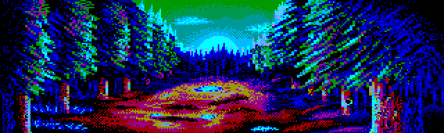

**Atari ST(E)**: 16 colors from 512, four bitplanes, free pixels.


**DOS (VGA mode 13h)**: 256 colors from a palette of 262,144, one
byte per pixel, no constraints worth the name.


**Spectrum Next**: 256 colors from 512 on Layer 2, free pixels. A
16-color master lands here PIXEL FOR PIXEL: the conversion is the
identity.


**MEGA65**: 255 colors from 16.7 million in full-color character
mode. Also an identity conversion for any master of 255 colors or
fewer, on or off any grid.


**Agon Light**: 64 fixed colors (a 2-bit RGB cube), 640 pixels across
at half width. No palette to choose, so the art meets a fixed grid.

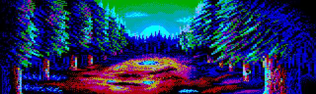

**MSX2**: 16 colors from 512, free pixels, in a 256-wide window: the
band is cropped, so this machine shows less of the scene.

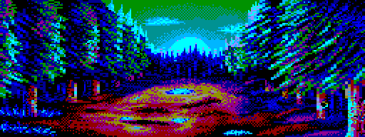

**Amstrad CPC (Mode 0)**: 160 pixels across at double width, 16 inks
chosen from 27, and no cell rule at all, so color may change every
pixel.

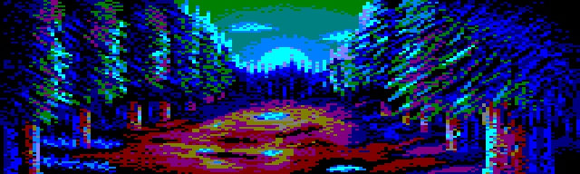

**Commodore 64**: 160 across at double width, three colors per 4x8
cell plus one background shared by the whole picture, all from a fixed
sixteen. The cell rule is the classic constraint, and solving it well
is most of the work.

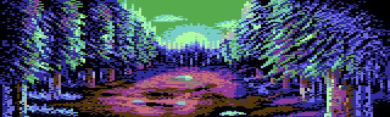

**Commodore Plus/4**: the same bitmap shape with its own arithmetic,
two colors per cell beside two global registers, chosen from 121
shades (sixteen hues at eight brightnesses), which buys subtler
gradients than the C64 at the cost of one cell color.

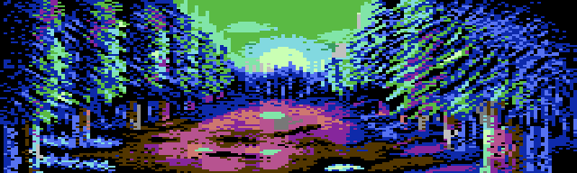

**Atari 8-bit (ANTIC mode E)**: 160 across, four colors at a time,
but the palette may change EVERY SCANLINE, chosen from 128 shades. A
band is solved line by line.

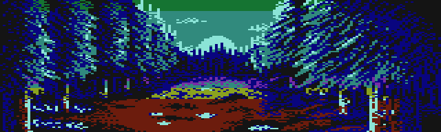

**MSX1 (Screen 2)**: 256 wide, and two colors per 8x1 strip from a
fixed fifteen: eight pixels wide, one pixel tall, the tightest cell in
the family.

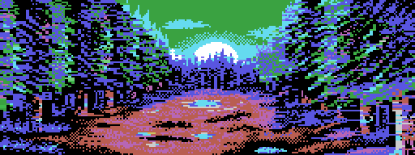

**Apple II (DHGR)**: color is not a palette here but an artifact of
the NTSC signal, so the converter chooses each of the 560 dots per
line to make the decoder show the painting, reaching hues between the
machine's sixteen. Shown as a composite display renders it, which is
the machine's own output; an RGB card decodes the same bytes as
sixteen flat colors.

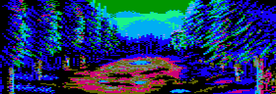

**ZX Spectrum +3**: 256 wide, two colors per 8x8 cell, and both must
share one brightness bit. The hardest constraint in the family, and
the reason the automatic conversion ships in BLACK AND WHITE: at this
cell size color is a matter of composition rather than of nearest
match, and a tool that guesses at it produces the muddy look the
machine is unfairly famous for. What `arcimg` gives you is a clean,
honest halftone that is finished art in its own right.

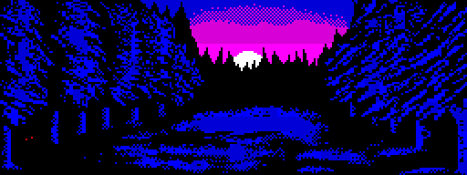

If you want Spectrum color, the machine rewards taking it by hand,
and section 5's polish loop is built for exactly that: `arcimg scr`
writes the conversion out as a standard `.scr` screen, you paint it in
your Spectrum tool of choice, and `arcimg unscr` brings it back as the
target's picture, which `convert` will never overwrite afterwards.
This is the same scene after that treatment:


**TRS-80 Model 4**: one bit per pixel, 640 across at half width, no
color at all. The whole quality budget of a monochrome machine is its
halftone.

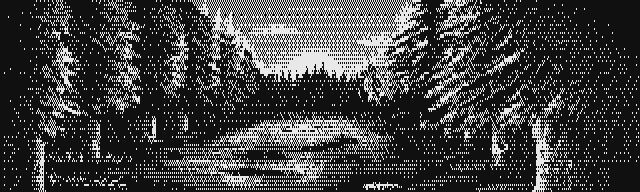
